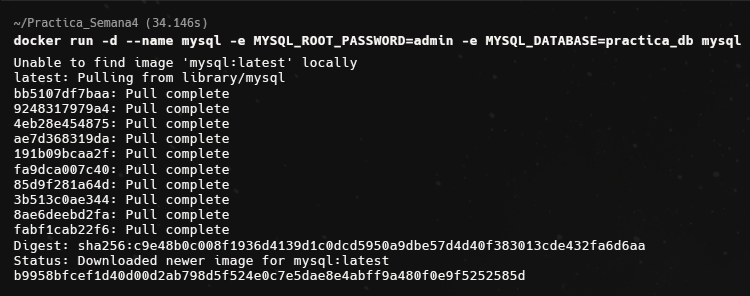
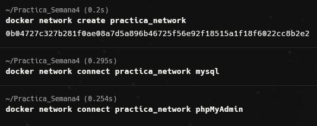
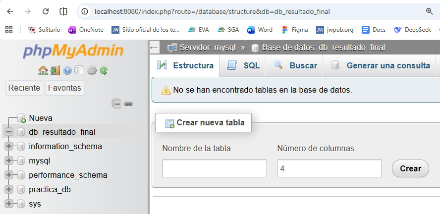

# Práctica No 4: Red de contenedores mysql y phpmyadmin

## 1. Título
Implementación de una red personalizada en Docker para la interconexión de MySQL y phpMyAdmin.

## 2. Tiempo de duración
60 minutos.

## 3. Fundamentos
La comunicación entre contenedores es uno de los pilares de la orquestación en Docker. Por defecto, cuando instalamos Docker, se crea una red llamada bridge.
Sin embargo, los contenedores conectados a esta red predeterminada solo pueden comunicarse entre sí a través de direcciones IP. Dado que las direcciones IP
de los contenedores son efímeras y cambian cada vez que un contenedor se reinicia, este método no es escalable ni fiable para entornos de producción.

Para resolver este problema, Docker permite la creación de User-Defined Bridge Networks (Redes puente definidas por el usuario). La principal ventaja de estas
redes es el Aislamiento y la Resolución Automática de Nombres (DNS). Cuando dos contenedores, como MySQL y phpMyAdmin, se unen a una misma red personalizada, 
Docker activa un servidor DNS interno. Esto permite que un contenedor encuentre a otro simplemente utilizando su nombre (parámetro --name), eliminando la necesidad 
de rastrear direcciones IP manuales.

En esta arquitectura, el contenedor de base de datos (MySQL) actúa como el servidor, exponiendo el puerto 3306 internamente dentro de la red. Por otro lado, 
el contenedor de phpMyAdmin actúa como un cliente web. Al configurar la variable de entorno PMA_HOST con el nombre del contenedor de MySQL, el servidor web 
de phpMyAdmin puede dirigir sus peticiones de gestión de datos de forma segura y directa a través del túnel virtual que proporciona la red personalizada, 
garantizando que el tráfico de la base de datos no esté necesariamente expuesto al mundo exterior, sino solo a través de la interfaz administrativa controlada.

## 4. Conocimientos previos
- Manejo de terminal Linux (CLI).
- Comandos Docker.

## 5. Objetivos
- Crear una red personalizada en Docker para establecer un entorno de comunicación aislado.

- Desplegar un servidor de base de datos MySQL configurando credenciales de acceso seguras.

- Implementar una interfaz gráfica conectada al servidor de base de datos mediante la resolución de nombres de Docker.

- Validar la comunicación entre servicios creando una base de datos de prueba desde el entorno web.

## 6. Equipo necesario
- Computadora.
- Docker Desktop/WSL2
- Warp Terminal.
- Navegador Web.

## 7. Material de apoyo.
- Video clase sobre red en contenedores.
- Repositorio Git de comandos CheatSheet redes de contenedoresURL.

## 8. Procedimiento

Paso 1: Despliegue del contenedor de MySQL
Se lanzó el motor de base de datos configurando la contraseña del root y una base de datos inicial, conectándolo a la red creada.

Comando utilizado: docker run -d --name mysql -e MYSQL_ROOT_PASSWORD=admin -e MYSQL_DATABASE=practica_db mysql

Paso 2: Despliegue del contenedor de phpMyAdmin
Se creó el contenedor de la interfaz gráfica, vinculándolo a la misma red y apuntando al host mysql.

Comando utilizado: docker run -d --name phpmyadmin -e PMA_HOST=mysql -p 8080:80 phpmyadmin

Paso 3: Creación de la red personalizada
Se creó la red para permitir el descubrimiento de servicios por nombre.

Comando Utilizado: docker network create practica_network

Y se realizó la conexión de los contenedores a la red creada.

Comandos: docker network connect practica_network mysql  y  docker network connect practica_network phhpmyadmin

Paso 4: Conexión y creación BD.
Se accedió a localhost:8080 y se colocaron las credenciales para entrar al panel administrativo.
Por consiguiente, se creó una BD mediante phpmyadmin para confirmar conexión.

## 9. Resultados esperados
Creación correcta de los contenedores y conexión con la red interna creada.

## Contenedor MySQL

Se puede observar el comando que se utilizo para crear el primer contenedor con mysql.

## Contenedor Phpmyadmin

En esta imagen se muestra el comando utilizado para crear el contenedor con phpmyadmin. Cabe recalcar que, primero se utilizo el
comando: docker run -d --name phpMyAdmin -e PMA_HOST=servidor_mysql -p 8080:80 phpmyadmin. Pero al observer que se cometió un error al crear
se ejecuto el comando de la imagen para crear de nuevo y de una vez conectarlo a la red ya creada.

## Configuración Red.

En esta imagen se puede ver la configuración para crear la red interna y conectar los dos contenedores.

## Creación BD de prueba

En esta imagen se puede ver la pruieba de conexión entre los dos contenedores al ya haber creado la Base de Datos llamada: db_resultado_final.

## 10. Bibliografía
- Docker. (2026). Docker documentation. Docker. https://docs.docker.com/
- Guaman, M. (2024). Puertos y Red en contenedores. Github. https://wobbly-zephyr-621.notion.site/Puertos-y-red-en-contenedores-3e0d8eb9bb184dfd8690c50c41d0ff6d

